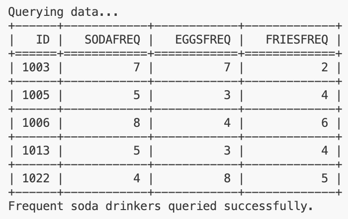
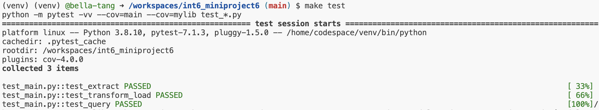
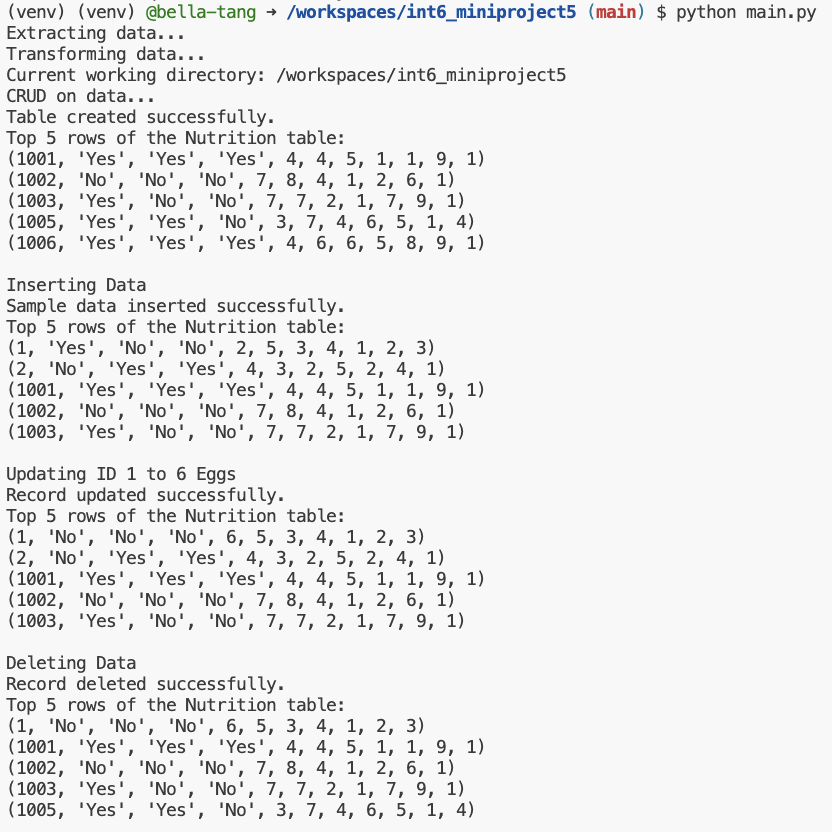

## int6_miniproject5
[](https://github.com/nogibjj/int6_miniproject5/actions/workflows/cicd.yml)
### File Structure
```
int6_miniproject5
├── .devcontainer/
│   ├── devcontainer.json
│   └── Dockerfile
├── .github/
│   └── workflows/cicd.yml
├── .gitignore
├── LICENSE
├── Makefile
├── Nutrition.db
├── README.md
├── data
│   └── Nutrition.csv
├── main.py
├── mylib
│   ├── __init__.py
│   ├── __pycache__
│   ├── extract.py
│   ├── query.py
│   └── transform_load.py
├── requirements.txt
├── setup.sh
└── test_main.py
```
This repo contains work for mini-project 5. It sets up an environment on codespaces and uses Github Actions to run a Makefile for the following: `make install`, `make test`, `make format`, and `make lint`. This project also has additional actions for `make extract`, `make transform_load`, and `make query`.

Some important components:

* `Makefile`

* `Dockerfile`

* A base set of libraries for devops and web

* `githubactions` 

## Purpose of project
The purpose of this project is to create a basic ETL pipeline with CRUD operations and SQL queries. The dataset was sourced from the [fivethirtyeight github](https://github.com/fivethirtyeight/data/blob/master/nutrition-studies/raw_anonymized_data.csv) and details individuals' health and nutrition information. For ease of use, we connect to an SQLite database.

## Important Functions
* `extract()` from extract.py: extracts data from github URL and saves it as a CSV
* `transform_load()` from transform_load.py: loads the CSV into a SQLite database
* `create_table()`, `insert_data()`, `read_data()`, `update_data()`, `delete_data()` from query.py: performs CRUD operations
* `query_frequent_soda()` from query.py: returns individuals with soda frequency over 3
* `query_heart_disease()` from query.py: returns eating habits of individuals with heart disease

These functions are tested in test_main.py. To make sure github actions is working properly, I use a Makefile to test various parts of my code.

## Preparation
1. Open codespaces 
2. Wait for container to be built and virtual environment to be activated with requirements.txt installed 
3. Run `make extract`
4. Run `make transform_load`
4. Run `make query`

## Sample Query and Output
Running `query_frequent_soda()` outputs:




## Check format and test errors 
1. Format code `make format`
2. Lint code `make lint`
3. Test code `make test`


## Successful Database Operations


## References 
forked from: https://github.com/nogibjj/sqlite-lab