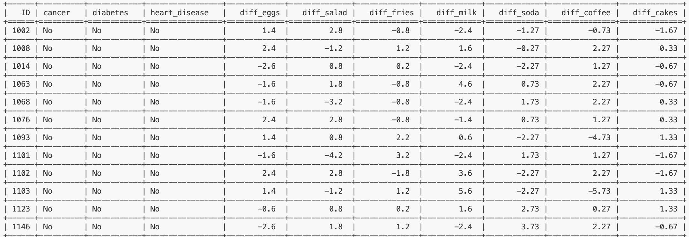

## int6_miniproject5
[](https://github.com/nogibjj/int6_miniproject6/actions/workflows/cicd.yml)
### File Structure
```
int6_miniproject6
├── .devcontainer/
│   ├── devcontainer.json
│   └── Dockerfile
├── .github/
│   └── workflows/cicd.yml
├── .gitignore
├── LICENSE
├── Makefile
├── README.md
├── data
│   └── Nutrition.csv
├── main.py
├── mylib
│   ├── __init__.py
│   ├── __pycache__
│   ├── extract.py
│   ├── query.py
│   └── transform_load.py
├── requirements.txt
├── setup.sh
└── test_main.py
```
This repo contains work for mini-project 6. It sets up an environment on codespaces and uses Github Actions to run a Makefile for the following: `make install`, `make test`, `make format`, and `make lint`. This project also has additional actions for `make extract`, `make transform_load`, and `make query`.

Some important components:

* `Makefile`

* `Dockerfile`

* A base set of libraries for devops and web

* `githubactions` 

## Purpose of project
The purpose of this project is to create an ETL-Query pipeline using Databricks. The dataset was sourced from the [fivethirtyeight github](https://github.com/fivethirtyeight/data/blob/master/nutrition-studies/raw_anonymized_data.csv) and details individuals' health and nutrition information.

## Important Functions
* `extract()` from extract.py: extracts data from github URL and saves it as a CSV
* `transform_load()` from transform_load.py: loads the CSV into a SQLite database
* `query_nutrition()` from query.py: returns individuals with soda frequency over 3

These functions are tested in test_main.py. To make sure github actions is working properly, I use a Makefile to test various parts of my code.

## Preparation
1. Open codespaces 
2. Wait for container to be built and virtual environment to be activated with requirements.txt installed 
3. Run `make extract`
4. Run `make transform_load`
4. Run `make query`

## Complex Query Output/Explanation
The complex SQL query is called `query_nutrition()`
#### Breakdown of Query
* This query is designed to compare an individual's food frequencies against other people who share their same health conditions. It can give us insight into whether an individual is relatively "healthy" or "unhealthy" compared to their respective groups in order to inform better diet decisions.
* `Nutrition_avg` is a CTE that **aggregates** the average frequency of food consumption for each group of people, grouped by their health conditions (whether they have cancer, diabetes, heart disease, or a combination). It has a total of 8 rows with food averages rounded to 2 decimal points (i.e. avg_eggs).
* The main query **joins** the original `Nutrition` table with the `Nutrition_avg` CTE using the cancer, diabetes, and heart_disease columns as the join condition. This allows each individual in the original dataset to be compared against the group average for people with the same health conditions.
    * For each individual (n.ID), the query calculates the difference between their specific food consumption and the group average (i.e. diff_eggs).
    * The query then **sorts** the results by the cancer, diabetes, heart_disease, and ID (ascending) variables, so individuals with the same health conditions are listed consecutively in order of ID.
#### Expected Result
* The query will return a list of individuals (ID) along with their health conditions (cancer, diabetes, heart_disease) and the differences between their personal food consumption and the average consumption of individuals with the same health conditions.
* Positive values in the *diff* columns indicate that the individual consumes more than the group average for that particular food, while negative values indicate that they consume less.

#### Sample Output



## Check format and test errors 
1. Format code `make format`
2. Lint code `make lint`
3. Test code `make test`


## References 
template from: https://github.com/nogibjj/int6_miniproject5  
forked from: https://github.com/nogibjj/sqlite-lab